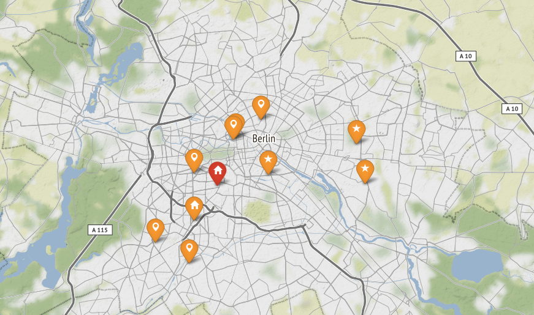

# Drawing Maps with Python

This is material for a short Python workshop to create awesome interactive maps.

It uses `folium`, the number one Python library for drawing maps.

## Preparations

Open a command prompt and install two Python packages:

    pip install folium
    pip install geopy

## Contents

The material covers:

* finding coordinates given an address
* placing markers and lines
* working with GeoJSON files
* coloring countries and districts
* integrate maps into a website

You find the examples in [Folium_examples.ipynb](Folium_examples.ipynb)

An example for using `folium` inside a `flask` server is in [server.py](server.py)

## Exercises

### 1. Mysterious locations

Examine the data in [data/exercise1.txt](data/exercise1.txt). The addresses in the file have one thing in common. Which?

### 2. Draw coordinates

Draw the coordinates found in the first exercise on a map.

**Make a screenshot**

#### Fallback:

If exercise 1 did not work, continue with [data/exercise2.txt](data/exercise2.txt)

### 3. Districts

Identify the district for each location. Try one of two approaches:

* Parse the district out of the full address returned by `geopy`
* Read the polygon out of the GeoJSON file and use [check_poly.py](check_poly.py) to find which points are inside.

**Make a screenshot**

### 4. Choropleth

Color the districts by the number of data points inside.

#### Fallback:

If exercise 3 did not work, continue with [data/exercise2.txt](data/exercise2.txt)

## License

(c) 2018 Spiced Academy. Personal use only.
